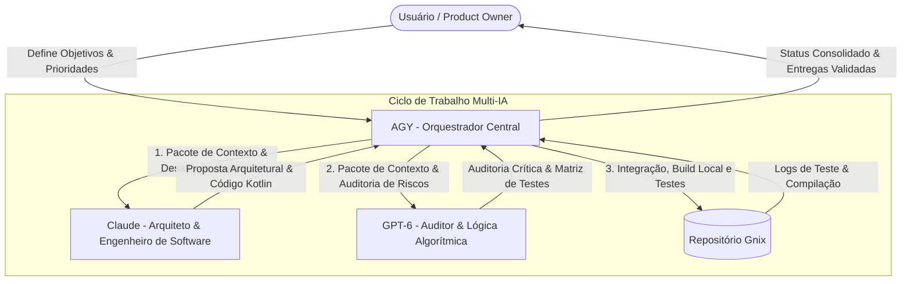

# Estratégia de Orquestração do Time de IA: AGY, Claude & GPT-6

## 1. Visão Geral & Papéis

Este documento define as diretrizes, papéis e fluxos operacionais para o time de Inteligência Artificial responsável pelo desenvolvimento e manutenção do projeto **Gnix**.

### Composição do Time:
- **AGY (Antigravity / Gemini) — Orquestrador Central & Operador de Ambiente (Tech Lead & DevOps)**
  - Acesso direto ao ambiente operacional (Windows / PowerShell / Bash).
  - Execução de comandos, compilações (Gradle), testes locais (`bash test-core.sh`) e controle de versão (Git).
  - Coordenação de handoffs, validação de integridade e consolidação de entregas.
- **Claude (ex: Claude 3.7 / Claude Code) — Arquiteto de Software & Engenheiro Kotlin (Staff Engineer)**
  - Arquitetura limpa, desacoplamento de classes e conformidade com padrões Android.
  - Implementação idiomática em Kotlin, design system (`GnixViews`) e refinamento de interface.
  - Revisão rigorosa de código e clareza estrutural.
- **GPT-6 (ex: OpenAI o-series / GPT-6) — Estrategista Lógico & Auditor de Segurança (Principal Engineer & Red Team)**
  - Modelagem de concorrência e algoritmos complexos (download paralelo, cache e busca local).
  - Análise adversarial (Red Teaming): descoberta de edge cases, timeouts de rede, XML malformado e falhas de memória.
  - Elaboração de matrizes exaustivas de testes unitários.



---

## 2. Matriz RACI de Responsabilidades

| Atividade | AGY (Orquestrador) | Claude (Arquiteto) | GPT-6 (Auditor) | Usuário (PO) |
| :--- | :---: | :---: | :---: | :---: |
| **Definição de Requisitos e Escopo** | **A** (Accountable) | C (Consulted) | C (Consulted) | **R** (Responsible) |
| **Arquitetura de Módulos e UI** | C (Coordena) | **R** (Desenvolve) | C (Revisa lógica) | I (Informed) |
| **Implementação de Código Kotlin/Android** | C (Aplica & Valida) | **R** (Codifica) | C (Otimiza trechos) | I (Informed) |
| **Lógica de Concorrência & Algoritmos** | C (Testa local) | C (Implementa) | **R** (Modela) | I (Informed) |
| **Auditoria Crítica & Edge Cases** | I (Aplica fixes) | C (Corrige) | **R** (Identifica falhas) | I (Informed) |
| **Execução de Build, Testes e Lint** | **R** (Executa no OS) | C (Suporte a bugs) | C (Análise de logs) | I (Informed) |
| **Aprovação Final da Release** | C (Gera relatório) | I (Informed) | I (Informed) | **A / R** (Aprova) |

*(R = Responsible, A = Accountable, C = Consulted, I = Informed)*

---

## 3. Protocolos Operacionais de Handoff

### Fase 1: Triagem & Geração do Pacote de Contexto (AGY)
Antes de qualquer alteração, o **AGY**:
1. Lê o estado do projeto (`git status`, arquivos relevantes em `app/src/main/java/com/gnix/app/`).
2. Gera um **Context Pack** conciso contendo:
   - Objetivo da tarefa.
   - Restrições técnicas (ex: Android 8.1 API 27 a Android 16 API 36, sem dependências externas pesadas).
   - O trecho de código exato a ser modificado ou auditado.

### Fase 2: Construção Arquitetural (Claude)
- O prompt é direcionado ao Claude focando em elegância, idioma Kotlin e padrões de interface.
- Claude retorna o código completo ou diff cirúrgico.

### Fase 3: Auditoria Crítica e Casos de Borda (GPT-6)
- O código proposto é submetido ao GPT-6 com foco em:
  - *Onde isso falha com conexões lentas ou instáveis?*
  - *Existe risco de vazamento de memória ou race condition?*
  - *Quais testes unitários adicionais devem ser escritos?*

### Fase 4: Aplicação, Testes e Validação Local (AGY)
- AGY aplica as alterações nos arquivos do projeto.
- Executa imediatamente a suite de testes locais:
  ```bash
  bash test-core.sh
  ```
- Se houver falhas, reintroduz os erros no ciclo para ajuste imediato.
- Registra as alterações e reporta ao usuário com instruções claras de uso.

---

## 4. Templates de Despacho (Prompts Padronizados)

### Template para Claude (Arquitetura e Código):
```markdown
[CONTEXTO GNIX]
App Android nativo em Kotlin/Java sem dependências externas (minSdk 27, targetSdk 36).
Design System: Cores preto (#0D0D0F) e vermelho (#E53935) em GnixViews.kt.

[TAREFA]
{Descrever o componente ou refatoração desejada}

[CÓDIGO ATUAL]
{Trecho do arquivo}

[RESTRIÇÕES]
1. Código 100% idiomático em Kotlin.
2. Manter compatibilidade do Android 8.1 ao Android 16.
3. Não adicionar dependências pesadas no Gradle sem necessidade estrita.
```

### Template para GPT-6 (Auditoria e Casos de Borda):
```markdown
[CONTEXTO GNIX]
Leitor de RSS/Atom local para Android.

[PROPOSTA DE CÓDIGO]
{Código proposto pelo Claude ou AGY}

[AUDITORIA REQUERIDA]
1. Identifique potenciais race conditions, deadlocks ou gargalos de I/O.
2. Como esse código se comporta com feeds RSS corrompidos ou respostas HTTP 429/500?
3. Gere 3 cenários de teste unitário essenciais para cobrir os principais edge-cases.
```

---

## 5. Próximas Metas Recomendadas para o Gnix
1. **Pipeline de Feeds Concorrentes**: Substituir a execução sequencial em `MainActivity.kt` por downloads paralelos com timeout independente.
2. **Miniaturas de Notícias**: Extrair tags de imagem (`<enclosure>`, `<media:content>`) no `FeedParser.java` e exibir nos cards.
3. **Desacoplamento da Interface**: Extrair o gerenciamento de estado da `MainActivity` para um `FeedStateHolder` desacoplado.
