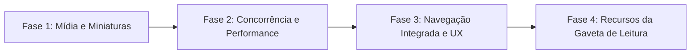

# PLANO MESTRE GNIX: ESTRATÉGIA, ORQUESTRAÇÃO E EVOLUÇÃO DO PRODUTO

> **Documento Consolidado Único**  
> Localização: `D:\Drive\Codigo\Gnix-codigo-Android81mais\Gnix\PLANO_MESTRE.md`  
> Projeto: **Gnix** (App nativo Android de notícias e curadoria de RSS/Atom)

---

## 1. Visão Geral do Produto

O **Gnix** é um aplicativo Android nativo, privado e de alto desempenho para leitura de notícias e curadoria de feeds RSS/Atom.

* **Público & Experiência**: Formato de edição/newsletter diária em cartões, sem necessidade de login, conta em nuvem ou rastreamento.
* **Identidade Visual**: Tema dark editorial com estética vermelho e preto:
  * Fundo: `#0D0D0F`
  * Cartões/Superfície: `#1B1B1F`
  * Destaques/Ações primárias: Vermelho `#E53935`
  * Tipografia: Texto principal `#FAFAFA`, texto secundário `#B8B8C2`
* **Compatibilidade**: Mínimo Android 8.1 (API 27) até Android 16 (API 36).
* **Filosofia de Engenharia**: Zero dependências de bibliotecas de terceiros pesadas; interface construída diretamente em Views nativas com Kotlin e Java padrão, garantindo peso mínimo do APK e máxima velocidade de carregamento.

---

## 2. Governança e Orquestração do Time de IA

O desenvolvimento é conduzido por uma equipe integrada de Inteligências Artificiais com papéis complementares e sem sobreposição:


### 2.1 Papéis e Especialidades (Matriz RACI)

| Etapa / Atividade | AGY (Orquestrador) | Claude (Arquiteto) | GPT-6 (Auditor) | Usuário (PO) |
| :--- | :---: | :---: | :---: | :---: |
| **Definição de Escopo & Prioridades** | **A** (Accountable) | C (Consulted) | C (Consulted) | **R** (Responsible) |
| **Arquitetura de UI e Componentes** | C (Coordena) | **R** (Desenvolve) | C (Revisa) | I (Informed) |
| **Implementação de Código Kotlin** | C (Aplica & Valida) | **R** (Codifica) | C (Otimiza) | I (Informed) |
| **Concorrência, Cache & Algoritmos** | C (Testa) | C (Implementa) | **R** (Modela) | I (Informed) |
| **Auditoria Crítica & Edge Cases** | I (Aplica fixes) | C (Ajusta) | **R** (Identifica) | I (Informed) |
| **Execução de Build, Testes e Lint** | **R** (Executa no OS) | C (Suporte a bugs) | C (Análise de erros) | I (Informed) |
| **Aprovação Final da Release** | C (Gera relatório) | I (Informed) | I (Informed) | **A / R** (Aprova) |

*(R = Responsible, A = Accountable, C = Consulted, I = Informed)*

### 2.2 Protocolo de Handoff Operacional
1. **Triagem (AGY)**: Analisa o código atual e gera o *Context Pack* com o escopo exato e restrições.
2. **Construção (Claude)**: Produz o código idiomático em Kotlin e componentes visuais.
3. **Desafio Crítico (GPT-6)**: Audita o código proposto contra falhas de rede, vazamentos de memória e gera matriz de testes.
4. **Integração e Teste (AGY)**: Aplica o código no repositório e executa a bateria de testes (`bash test-core.sh`).

---

## 3. Templates de Despacho de Tarefas

### Para o Claude (Arquitetura & Código):
```markdown
[PROJETO GNIX - ANDROID]
App nativo em Kotlin/Java sem dependências externas (minSdk 27, targetSdk 36).
Identidade: Fundo #0D0D0F, Cartões #1B1B1F, Destaque #E53935 em GnixViews.kt.

[DEMANDA]
{Descrever o componente ou refatoração a ser feita}

[CÓDIGO ATUAL]
{Trecho do arquivo do Gnix}

[CRITÉRIOS DE ACEITE]
1. Código 100% idiomático em Kotlin com reciclagem correta de Views.
2. Compatibilidade estrita do Android 8.1 ao Android 16.
3. Não adicionar dependências pesadas sem aprovação prévia.
```

### Para o GPT-6 (Auditoria & Lógica Crítica):
```markdown
[PROJETO GNIX - AUDITORIA DE CÓDIGO]
Módulo de leitor RSS/Atom e persistência local Android.

[CÓDIGO PROPOSTO]
{Código fornecido por Claude ou AGY}

[CHECKLIST DE AUDITORIA]
1. Identifique possíveis race conditions, deadlocks ou gargalos de I/O em rede instável.
2. Avalie comportamento com XML/Atom corrompido, datas ausentes e redirects HTTP.
3. Forneça 3 cenários de teste unitário exaustivos cobrindo casos de borda.
```

---

## 4. Roadmap de Evolução Técnica (Inspirado no App iOS "Gaveta")

Recursos identificados na referência iOS de alta qualidade para elevar a experiência do Gnix a nível comercial:



### Fase 1: Suporte a Imagens e Miniaturas de Notícias (Rich Cards)
* **Objetivo**: Elevar o apelo visual dos cartões de notícias de puro texto para cards com capas editoriais.
* **Componentes afetados**:
  * `FeedParser.java`: Extrair URLs de imagem em `<enclosure type="image/...">`, `<media:content>` e `` dentro de `<description>`.
  * `Article.java`: Novo campo `imageUrl: String`.
  * `GnixViews.kt` & `ArticleAdapter.kt`: Componente de imagem 16:9 arredondada com carregamento assíncrono e cache leve de `Bitmap` em memória (`LruCache`).

### Fase 2: Performance de Rede & Atualização Instantânea
* **Objetivo**: Reduzir o tempo de atualização de múltiplos feeds de ~8 segundos para ~1,5 segundo.
* **Componentes afetados**:
  * `MainActivity.kt`: Migrar de `Executors.newSingleThreadExecutor()` para um pool concorrente (`Executors.newFixedThreadPool(4)`).
  * `FeedClient.java`: Habilitar compressão `Accept-Encoding: gzip` com descompactação via `GZIPInputStream`.
  * `NewsRepository.java`: Timeouts granulares e independentes por feed (evitando que uma fonte lenta trave as demais).

### Fase 3: Navegação Integrada (Custom Tabs) & Gestos
* **Objetivo**: Proporcionar leitura suave da matéria completa sem perder o contexto do aplicativo.
* **Componentes afetados**:
  * `MainActivity.kt`: Abertura dos links via Chrome Custom Tabs estilizado com cores `#0D0D0F`, mantendo a transição instantânea.
  * `GnixViews.kt`: Listener de toque para gesto de **Pull-to-Refresh** no topo da lista.
  * Haptic Feedback tátil ao salvar ou atualizar notícias.

### Fase 4: Gestão Avançada da "Gaveta" de Leitura & Compartilhamento
* **Objetivo**: Potencializar as funcionalidades de leitura posterior e disseminação de conteúdo.
* **Componentes afetados**:
  * `LocalStore.kt`: Armazenamento de lista de artigos lidos (`read_articles.json`) com atenuação visual de contraste para notícias já consumidas.
  * `ArticleAdapter.kt`: Ação rápida de compartilhamento nativo (`Intent.ACTION_SEND`) com texto estruturado (Título + Link + "Via Gnix").
  * Importação e Exportação de listas de fontes via arquivo **OPML** padrão.

---

## 5. Procedimentos de Verificação e Validação

Todas as alterações propostas pelo time devem ser validadas através da rotina obrigatória:

1. **Validação Lógica Básica (Sem Android SDK)**:
   ```bash
   bash test-core.sh
   ```
   *Garante integridade de parser, persistência e modelos Java.*
2. **Validação de Compilação & Lint (Ambiente Completo)**:
   ```bash
   bash build-apk.sh
   ```
   *Executa `:app:testDebugUnitTest`, `:app:lintDebug` e compilação do APK.*
3. **Critérios de Aceite para Releases**:
   - Zero regressão de layout em telas com proporções 18:9, 19.5:9 e 20:9.
   - Funcionamento offline íntegro (acesso total às notícias em cache e aos salvos sem internet).
   - Inexistência de crashes diante de feeds RSS com formato inválido ou inexistente.
