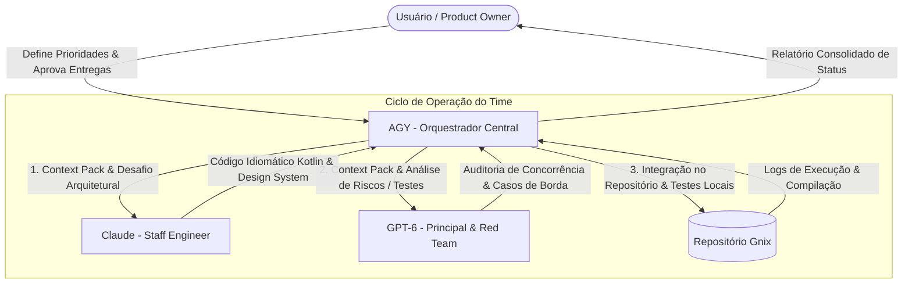
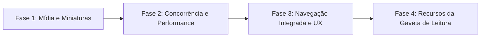

# PLANO MESTRE GNIX: ESTRATÉGIA, ORQUESTRAÇÃO E EVOLUÇÃO DO PRODUTO

> **Documento Consolidado Único**  
> Localização: `D:\Drive\Codigo\Gnix-codigo-Android81mais\Gnix\PLANO_MESTRE.md`  
> Projeto: **Gnix** (App nativo Android de notícias e curadoria de RSS/Atom)

---

## 1. Visão Geral do Produto

O **Gnix** é um aplicativo Android nativo, privado e de alto desempenho para leitura de notícias e curadoria de feeds RSS/Atom.

* **Público & Experiência**: Formato de edição/newsletter diária em cartões, sem necessidade de login, conta em nuvem ou rastreamento.
* **Identidade Visual**: Tema dark editorial com estética vermelho e preto:
  * Fundo: `#0D0D0F`
  * Cartões/Superfície: `#1B1B1F`
  * Destaques/Ações primárias: Vermelho `#E53935`
  * Tipografia: Texto principal `#FAFAFA`, texto secundário `#B8B8C2`
* **Compatibilidade**: Mínimo Android 8.1 (API 27) até Android 16 (API 36).
* **Filosofia de Engenharia**: Zero dependências externas — **sem AndroidX e sem bibliotecas de UI de terceiros**, e não apenas "sem bibliotecas pesadas": a restrição aprovada é a ausência total, porque é ela que sustenta o peso mínimo do APK e a compatibilidade desde a API 27 sem camada de compat. Interface construída diretamente em Views nativas com Kotlin e Java padrão.

---

## 2. Governança e Orquestração do Time de IA

O desenvolvimento é conduzido por uma equipe integrada de Inteligências Artificiais com papéis complementares e sem sobreposição:



### 2.1 Papéis e Especialidades (Matriz RACI)

| Etapa / Atividade | AGY (Orquestrador) | Claude (Arquiteto) | GPT-6 (Auditor) | Usuário (PO) |
| :--- | :---: | :---: | :---: | :---: |
| **Definição de Escopo & Prioridades** | **A** (Accountable) | C (Consulted) | C (Consulted) | **R** (Responsible) |
| **Arquitetura de UI e Componentes** | C (Coordena) | **R** (Desenvolve) | C (Revisa) | I (Informed) |
| **Implementação de Código Kotlin** | C (Aplica & Valida) | **R** (Codifica) | C (Otimiza) | I (Informed) |
| **Concorrência, Cache & Algoritmos** | C (Testa) | C (Implementa) | **R** (Modela) | I (Informed) |
| **Auditoria Crítica & Edge Cases** | I (Aplica fixes) | C (Ajusta) | **R** (Identifica) | I (Informed) |
| **Execução de Build, Testes e Lint** | **R** (Executa no OS) | C (Suporte a bugs) | C (Análise de erros) | I (Informed) |
| **Aprovação Final da Release** | C (Gera relatório) | I (Informed) | I (Informed) | **A / R** (Aprova) |

*(R = Responsible, A = Accountable, C = Consulted, I = Informed)*

### 2.2 Protocolo de Handoff Operacional & Gnix AI Bridge
A comunicação contínua e rastreável entre as três IAs é gerida pela **Gnix AI Bridge**:
* **Canal de Diálogo**: [`bridge/CHAT.md`](bridge/CHAT.md) (histórico vivo de alinhamento).
* **Barramento Estruturado**: [`bridge/bus.json`](bridge/bus.json) (mensagens com IDs, metadados e status).
* **CLI de Orquestração**: [`bridge.py`](bridge.py) (comandos `post`, `status`, `export-prompt`, `tail`).
* **Instruções de Bootstrapping**: [`bridge/PROMPT_CLAUDE.md`](bridge/PROMPT_CLAUDE.md) e [`bridge/PROMPT_CODEX.md`](bridge/PROMPT_CODEX.md).

Fluxo de trabalho:
1. **Triagem (AGY)**: Analisa o repositório, posta demanda inicial na ponte e gera o *Context Pack*.
2. **Construção (Claude)**: Recebe o despacho, produz código idiomático em Kotlin e componentes de UI nativa.
3. **Desafio Crítico (Codex / GPT-6)**: Audita contra falhas de rede, vazamentos de memória e valida concorrência.
4. **Integração e Teste (AGY)**: Aplica o código no repositório e executa a bateria de testes (`bash test-core.sh` / `bash build-apk.sh`).

---

## 3. Templates de Despacho de Tarefas

### Para o Claude (Arquitetura & Código):
```markdown
[PROJETO GNIX - ANDROID]
App nativo em Kotlin/Java sem dependências externas (minSdk 27, targetSdk 36).
Identidade: Fundo #0D0D0F, Cartões #1B1B1F, Destaque #E53935 em GnixViews.kt.

[DEMANDA]
{Descrever o componente ou refatoração a ser feita}

[CÓDIGO ATUAL]
{Trecho do arquivo do Gnix}

[CRITÉRIOS DE ACEITE]
1. Código 100% idiomático em Kotlin com reciclagem correta de Views.
2. Compatibilidade estrita do Android 8.1 ao Android 16.
3. Nenhuma dependência externa — AndroidX incluído — sem aprovação prévia e explícita do PO.
```

### Para o GPT-6 (Auditoria & Lógica Crítica):
```markdown
[PROJETO GNIX - AUDITORIA DE CÓDIGO]
Módulo de leitor RSS/Atom e persistência local Android.

[CÓDIGO PROPOSTO]
{Código fornecido por Claude ou AGY}

[CHECKLIST DE AUDITORIA]
1. Identifique possíveis race conditions, deadlocks ou gargalos de I/O em rede instável.
2. Avalie comportamento com XML/Atom corrompido, datas ausentes e redirects HTTP.
3. Forneça 3 cenários de teste unitário exaustivos cobrindo casos de borda.
```

---

## 4. Roadmap de Evolução Técnica (Inspirado no App iOS "Gaveta")

Recursos identificados na referência iOS de alta qualidade para elevar a experiência do Gnix a nível comercial.

> **Pré-condição de todo o roadmap — ATENDIDA em 2026-09-30.** O bloqueio era a ausência de `platforms/android-36` no SDK local (havia só 35 e 37.0), exigida por `compileSdk`/`targetSdk = 36`. Resolvido instalando `platform-36_r02.zip` direto de `dl.google.com`, com SHA-1 conferido contra o manifesto oficial `repository2-3.xml` — sem precisar do cmdline-tools. O APK existe e está verificado: `dist/Gnix.apk`, `com.gnix.app`, versionCode 3, minSdk 27, targetSdk 36, assinado (esquema v2, `apksigner verify` → `Verifies`). A partir daqui as fases abaixo têm base real para medir regressão.



### Fase 1: Suporte a Imagens e Miniaturas de Notícias (Rich Cards)
* **Objetivo**: Elevar o apelo visual dos cartões de notícias de puro texto para cards com capas editoriais.
* **Componentes afetados**:
  * `FeedParser.java`: Extrair URLs de imagem em `<enclosure type="image/...">`, `<media:content>` e `` dentro de `<description>`.
  * `Article.java`: Novo campo `imageUrl: String`.
  * `GnixViews.kt` & `ArticleAdapter.kt`: Componente de imagem 16:9 arredondada com carregamento assíncrono e cache leve de `Bitmap` em memória (`android.util.LruCache`, framework puro).
* **Restrições obrigatórias** (a URL da imagem vem do feed, logo é alvo de requisição escolhido por terceiro):
  * Toda URL de imagem passa por `FeedParser.safeUrl` e pelo mesmo teto de tamanho dos feeds, antes de qualquer download.
  * **Somente HTTPS.** O manifest declara `usesCleartextTraffic="false"`, então miniatura em `http://` — comum em feeds brasileiros — falha de forma silenciosa. O cartão precisa degradar limpo para o formato de texto atual, nunca exibir espaço vazio ou placeholder quebrado.
  * Extrair `` de dentro de `<description>` não pode reintroduzir interpretação de HTML: a regra vigente é HTML→texto, sem execução de script.
  * **Compatibilidade de cache verificada:** `LocalStore.kt:47` lê artigos com `optString`/`optLong`, portanto `cache.json` e `saved.json` gravados por versões anteriores continuam legíveis após a adição de `imageUrl` — sem migração e sem crash.

### Fase 2: Performance de Rede & Atualização Instantânea

> **FASE CONCLUÍDA — verificada em 2026-09-30 (Claude/Opus 5).** Todos os itens estão no código e cobertos por teste. Verificado lendo os arquivos, não presumido:
> * **Download concorrente com teto de 4** — `NewsRepository.java:30`: pool estático de 4 threads daemon nomeadas `gnix-feed`, submetido em `:44`.
> * **Timeouts independentes por feed** — `NewsRepository.java:48` faz `get(65, TimeUnit.SECONDS)` por future, sobre 15s de conexão, 15s de leitura e deadline de 60s no `FeedClient`. Uma fonte lenta ou morta não trava as demais; foi o que manteve as outras 10 fontes íntegras quando o Tecnoblog passou a responder 403.
> * **Compressão gzip** — `FeedClient.java:40` envia `Accept-Encoding: gzip` e `:61` descompacta via `GZIPInputStream`.
> * **Requisições condicionais (ETag / Last-Modified / 304)** — item que não estava no plano original. `FeedClient.java:41-42` envia `If-None-Match` e `If-Modified-Since`; `:51` trata o 304 devolvendo `LoadResult.notModified`, e o `NewsRepository` restaura o cache **daquela** fonte sem marcá-la como falha. Coberto pelos checks "304 should not mark source as failed" e "304 should keep cache articles" em `CoreChecks.java`.
>
> **A restrição do teto foi cumprida corretamente:** `FeedClient.java:66` conta `data.size() + count > LIMIT` dentro do laço que lê do stream **já descomprimido** (`:61`), então uma bomba de compressão é barrada. E `:58` só usa `Content-Length` como pré-checagem quando não há gzip — correto, porque o tamanho comprimido não representa o real.
>
> **O que NÃO fazer:** o `Executors.newSingleThreadExecutor()` em `MainActivity.kt:34` não deve ser trocado por um pool. Ele não busca feeds — o paralelismo de rede está uma camada abaixo. Ele serializa o trabalho fora da main thread e, com isso, serializa as escritas no `LocalStore`. Trocá-lo por um pool não ganha tempo e cria escrita concorrente sobre o mesmo `AtomicFile`, ou seja, uma corrida de dados onde hoje não existe nenhuma.
>
> A meta "~8s → ~1,5s" segue **sem linha de base medida**. Agora que o APK existe, qualquer afirmação de ganho precisa de medição em dispositivo, registrada antes e depois.

### Fase 3: Navegação Integrada & Gestos
* **Objetivo**: Proporcionar leitura suave da matéria completa sem perder o contexto do aplicativo.
* **Componentes afetados**:
  * `GnixViews.kt`: Listener de toque para gesto de **Pull-to-Refresh** no topo da lista. Framework puro, sem conflito de restrição.
  * Haptic Feedback tátil ao salvar ou atualizar notícias, via `View.performHapticFeedback`. Framework puro.
  * `MainActivity.kt`: **Custom Tabs — BLOQUEADO, pendente de decisão do PO.** Chrome Custom Tabs exige `androidx.browser`, o que contraria a restrição de AndroidX zero da seção 1. Existe o caminho de Intent cru com os extras `android.support.customtabs.*` e `EXTRA_TOOLBAR_COLOR`, sem a biblioteca, mas é acordo informal com o navegador, sem garantia de API e com degradação silenciosa para `ACTION_VIEW` quando não honrado. Só avançar após o PO decidir explicitamente entre: (a) abrir exceção para `androidx.browser`, (b) aceitar a versão por Intent cru com fallback, ou (c) manter o `ACTION_VIEW` atual, que já funciona e já valida o link em `openArticle` (`MainActivity.kt:429`).

### Fase 4: Gestão Avançada da "Gaveta" de Leitura & Compartilhamento
* **Objetivo**: Potencializar as funcionalidades de leitura posterior e disseminação de conteúdo.
* **Componentes afetados**:
  * `LocalStore.kt`: Armazenamento de lista de artigos lidos (`read_articles.json`) com atenuação visual de contraste para notícias já consumidas.
  * `ArticleAdapter.kt`: Ação rápida de compartilhamento nativo (`Intent.ACTION_SEND`) com texto estruturado (Título + Link + "Via Gnix").
  * Importação e Exportação de listas de fontes via arquivo **OPML** padrão.
* **Restrições obrigatórias para o OPML** (importar OPML é interpretar XML de arquivo arbitrário — é uma nova superfície de entrada não confiável):
  * O parsing reusa a blindagem já existente no `FeedParser`: rejeição de `<!DOCTYPE` e `<!ENTITY`, entidades externas desabilitadas, `EntityResolver` que lança.
  * Cada URL importada passa pela mesma cadeia da fonte manual: `https://` obrigatório, `FeedParser.safeUrl`, e validação ao vivo via `FeedClient` antes de ser persistida. O OPML não pode ser o atalho que aceita fontes que o formulário manual recusa.
  * A exportação grava apenas URLs de fontes, sem notícias em cache nem itens salvos.

---

## 5. Procedimentos de Verificação e Validação

Todas as alterações propostas pelo time devem ser validadas através da rotina obrigatória:

1. **Validação Lógica Básica (Sem Android SDK)**:
   ```bash
   bash test-core.sh
   ```
   *Garante integridade de parser, persistência e modelos Java.*
2. **Validação de Compilação & Lint (Ambiente Completo)**:
   ```bash
   bash build-apk.sh
   ```
   *Executa `:app:testDebugUnitTest`, `:app:lintDebug` e compilação do APK.*
3. **Critérios de Aceite para Releases**:
   - **Layout — testar pelos limiares reais, não por proporção de tela.** O `DisplayPolicy` não decide nada por proporção; decide por largura disponível em dp e por `fontScale`:
     ```java
     if (availableDp < 360 || fontScale >= 1.5f) return 1;
     return availableDp >= 600 ? 3 : 2;
     ```
     Testar em 18:9, 19.5:9 e 20:9 não exercita nenhum desses limites — as três proporções caem na mesma faixa de dp e produzem o mesmo resultado. A matriz correta é: largura **<360dp**, **360–599dp** e **≥600dp**, cruzada com `fontScale` **1.0**, **1.3** e **≥1.5**. É essa combinação que cobre a fonte grande e a janela dividida da checklist de verificação.
   - Funcionamento offline íntegro (acesso total às notícias em cache e aos salvos sem internet).
   - Inexistência de crashes diante de feeds RSS com formato inválido ou inexistente.
   - Rotação e janela dividida sem perda de estado de seleção, filtro ou busca.
